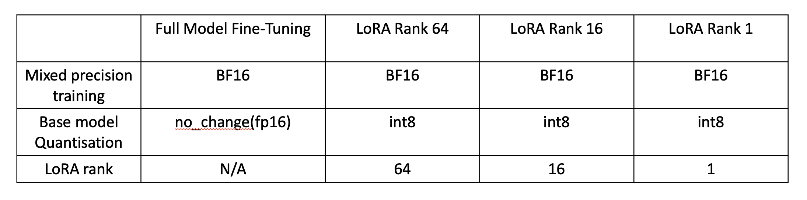
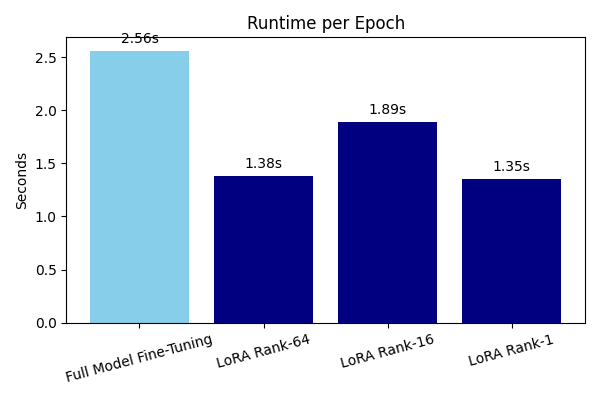
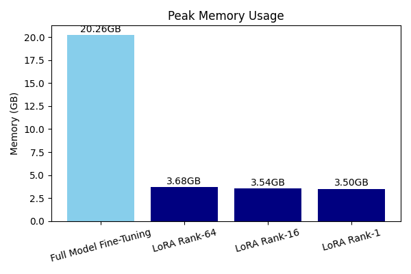

# HPML Project: Analyzing and Optimizing the Performance of Fine-Tuning Stable Diffusion Image Generative Model

## Team Information
- **Member**:  
  - Robin Hung-Ching Liu (hl3818)

## 1. Problem Statement

Fine-tuning large generative models like Stable Diffusion 3 (SD3) usually requires powerful hardware due to the large number of parameters and high memory usage. On cloud platforms such as Google Cloud Platform (GCP), GPU resources are often limited and expensive. For instance, the SD3 Medium model has about 2 billion parameters and causes out-of-memory (OOM) errors when training on a single NVIDIA L4 GPU with 24 GB memory. These hardware limitations make it difficult to fine-tune the model in a typical cloud environment.

The goal of this project is to make fine-tuning the SD3 Medium model feasible on limited hardware resources. We target accessibility on GCP by using optimization methods such as LoRA (Low-Rank Adaptation), mixed precision training with bfloat16 (bf16), and int8 quantization. We analyze their impact on training time, memory usage, and image quality. All experiments are conducted on a GCP instance with a single NVIDIA L4 GPU. Results are evaluated using PyTorch Profiler and qualitative review of generated images.

## 2. Model Description

We use the **Stable Diffusion 3 Medium** model from Stability AI, a diffusion-based text-to-image generation model with approximately 2 billion parameters.

### Optimization Approaches:
- **LoRA (Low-Rank Adaptation)**: Injects trainable low-rank matrices into selected layers.
- **Mixed Precision Training (bf16)**: Reduces memory consumption and accelerates training.
- **Int8 Quantization**: Minimizes memory usage during fine-tuning.

### Dataset:
We use the WikiArt Sargent dataset for fine-tuning.  
Dataset Link (https://drive.google.com/file/d/1capT9kF-zCu2OiNVzm7VG5DQDaAQLl1Q/)



All configuration files are located under the `./config` directory.

## 3. Summary of Final Results

- LoRA fine-tuning with int8 quantization achieves:
  - ~50% reduction in training time
  - ~80% reduction in peak memory usage  
  Compared to full model fine-tuning.

  


## 4. Reproducibility Instructions

### A. Requirements

#### 1. Follow the SimpleTuner Installation Guide

```bash
cd SimpleTuner
python3 -m venv .venv
source .venv/bin/activate
pip install -U poetry pip
poetry install
poetry run python -m unittest discover tests/  # Verify installation
```

#### 2. Download the Fine-Tuning Dataset

Download the [WikiArt Sargent dataset](https://drive.google.com/file/d/1capT9kF-zCu2OiNVzm7VG5DQDaAQLl1Q/) and set the paths in:

- `instance_data_dir` in `./config/multidatabackend.json.example`
- `cache_dir` and `cache_dir_vae` for model cache paths

#### 3. Copy Configuration Files

```bash
cp ./config/multidatabackend.json.example SimpleTuner/config/multidatabackend.json
cp ./config/config.json.64.example SimpleTuner/config/config.json
```

#### 4. Start Training

```bash
./train.sh
```

### B. Wandb Dashboard

Monitor training and evaluation metrics on the Wandb dashboard:  
Wandb Dashboard Link(https://wandb.ai/hl3818-columbia-university/lora-training)

### C. Train vs. Inference

To train with a different model setting, copy the desired config from `./config` to `SimpleTuner/config`, then run:

```bash
./train.sh
```

### D. Evaluation

If trained with PyTorch Profiler enabled, logs will be stored in `SimpleTuner/profiler_results/`.  
To view the results:

```bash
tensorboard --logdir=./profiler_results/
```

### E. Quickstart: Minimum Reproducible Result

Fine-tuned model checkpoints have been uploaded to Hugging Face.
- LoRA Rank 64: https://huggingface.co/RobinHCL/simpletuner-lora-64
- LoRA Rank 16: https://huggingface.co/RobinHCL/simpletuner-lora-16
- LoRA Rank 1: https://huggingface.co/RobinHCL/simpletuner-lora-1
- LoRA Rank 64(140000 epochs): https://huggingface.co/RobinHCL/simpletuner-lora-64-14000

To perform inference with the LoRA fine-tuned model using the same prompt as in the paper, run the following scripts in the `./inference` directory:

```bash
pip install torch torchvision
python3 lora_inference.py
python3 base_inference.py
# python3 full_model_fine_tune_inference.py
# Note: This script is unavailable due to OOM errors breaking the model upload pipeline.
# To run full model inference, re-train the model from scratch and manually save the weights.
```

## 5. Notes

- Full model fine-tuning is currently not reproducible with an NVIDIA L4 GPU due to OOM errors. Using a GPU with ≥32 GB VRAM should avoid these issues.
- PyTorch Profiler integration is included in SimpleTuner.  
  Key commit: [Profiler Commit](https://github.com/hungchingliu/coms6998-HPML-final-project/commit/88d2f45a5c221f592f5bb9dedb5934a03fce691b)  
  To disable the profiler: [No Profiler Commit](https://github.com/hungchingliu/coms6998-HPML-final-project/commit/aaf4b5b896d010d29cae4e9c9fe0d3f13702ae82)
  I sometimes encounter errors when using the profiler commit, I'll switch back to No Profiler Commit for keep fine-tuning the model

## References
### Existing Codebase
- The code for fine-tuning Stable Diffusion 3 is forked from [SimpleTuner](https://github.com/bghira/SimpleTuner) and located in the `SimpleTuner/` directory.
### Tutorial:
- [Stable Diffusion 3 Medium Fine-Tuning Tutorial](https://stabilityai.notion.site/Stable-Diffusion-3-Medium-Fine-tuning-Tutorial-17f90df74bce4c62a295849f0dc8fb7e)